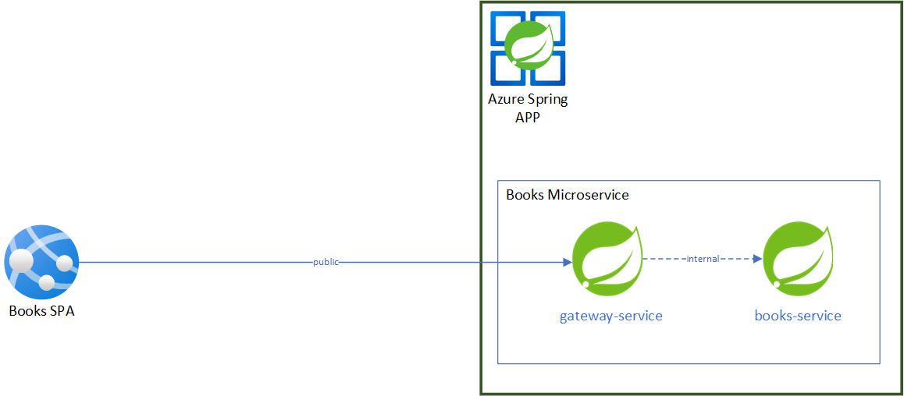
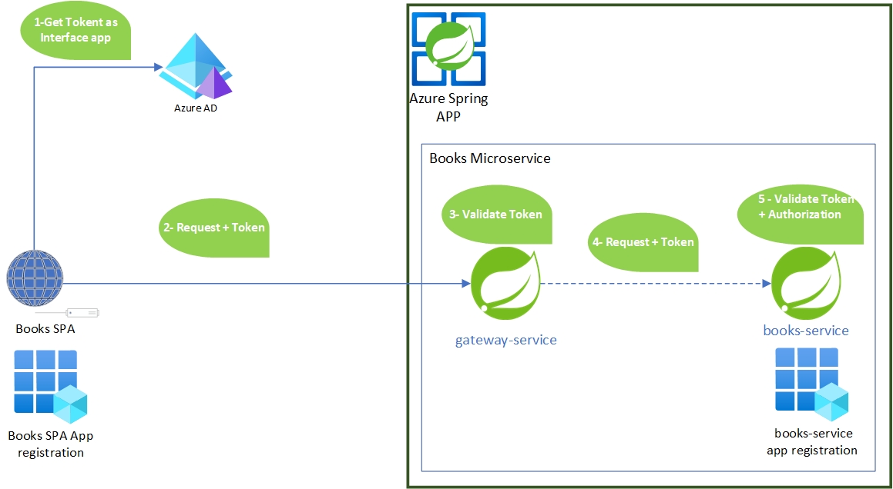
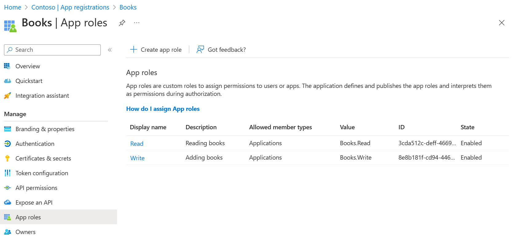
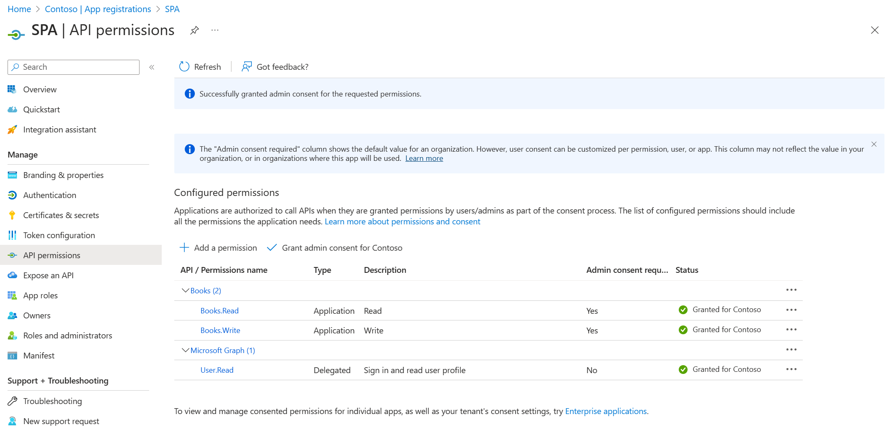

# Comprehensive Security with Azure Spring Apps, Application security principal, Spring Cloud Gateway, Spring Security, and Spring Cloud Azure Starter Active Directory.


This example shows the procedure of securing communication between a client application and a microservice application that is hosted on Azure Spring Apps and shielded behind a gateway app. The client application will be verified as a security principal to initiate contact with the microservice deployed on Azure Spring Apps, via the app built with [Spring Cloud Gateway](https://docs.spring.io/spring-cloud-gateway/docs/current/reference/html/). The methodology employs Spring Cloud Gateway's Token Relay feature, and Spring Security's Resource Server feature for the processes of authentication and authorization, realized through the execution of the [client credentials flow](https://learn.microsoft.com/en-us/azure/active-directory/develop/v2-oauth2-client-creds-grant-flow).

## Prerequisites

- Azure Spring Apps Consumption plan Instance, in which an application called books-service is created refer to this [documentation](https://learn.microsoft.com/azure/spring-apps/quickstart-provision-standard-consumption-service-instance) for provisionning.

## Architecture Overview 

The architecture of this example is demonstrated by a Books Application, consisting of the following components:

- [Books SPA](/spa): This locally hosted single page application (SPA) interacts with the book service's gateway through the public access to add or search for books.
- Books Microservice: 
    - A `gateway-service` app hosted in Azure Spring Apps, it interacts with `books-service` app through internal access.
    - A `books-service` app hosted in Azure Spring Apps. It stores book information in an H2 database.
    - The Books service app exposes two RESTful endpoints:
        - 'Add books' for saving books in an H2 database.
        - 'Get Book' for retrieving a book by ID.

   <br/>
  Overview of Books Application

## Security Flow

The communication between The Books SPA and the Books Microservice is secured through the [client credentials flow](https://learn.microsoft.com/en-us/azure/active-directory/develop/v2-oauth2-client-creds-grant-flow), utilizing the gateway app. This flow is as follows:

<br/>

1 - The Books SPA requests a token from Azure AD to call the `gateway-service` app. This token represents the Books SPA App registration as an application security principal. <br/>
2 - The Books SPA transmits a request with the acquired token to the `books-service` app through the `gateway-service` app. <br/>
3 - The `gateway-service` app validates the received token. <br/>
4 - The `gateway-service` app redirects the request (along with the token) to the `books-service` app. <br/>
5 - The `books-service` validates the token and authorizes the request. <br/>

## Environment Setup

### Register the Books application

#### Register application

First, we will configure the `books-service` app registration in Azure Portal.

1. If you have access to multiple tenants, use the **Directory + subscription** filter to select the tenant in which you want to register an application.

1. Search for and Select **Azure Active Directory**.

1. Under **Manage**, select **App registrations** > **New registration**.

1. Enter a name for your application in the **Name** field, for example `Books`. Users of your app might see this name, and you can change it later.

1. For **Supported account types**, select **Accounts in this organizational directory only **.

1. Select **Register** to create the application.

- After the Application is registered, retrieve the client ID from the app registration overview. This client ID will be necessary for configuring `books-service` app.

#### Add App Roles

As we are using the client credentials flow, and the microservices will be called by client applications security principals (i.e., the Books SPA in our case), we will define App roles for our `books-service` App registration. App roles are used for assigning permissions to users or apps, and are the recommended way for assigning permissions in the client credentials flow. For more details, refer to the [app roles documentation](https://learn.microsoft.com/en-us/azure/active-directory/develop/howto-add-app-roles-in-azure-ad-apps). 

We will add 2 App roles: 'Books.Write' (allows the SPA to add books) and 'Books.Read' (allows the SPA to read a book by ID).

1. On the app **Overview** page, look for the **Application (client) ID** value, and then record it for later use. You need it to configure the YAML configuration file for this project.

1. Under **Manage**, select **Expose an API**, find the **Application ID URI** at the beginning of the page, select **Add**.

1. On the **Edit application ID URI** page, accept the proposed Application ID URI (`api://{client ID}`) or use a meaningful name instead of the client ID,
   such as `api://books`, and select **Save**.

1. Under **Manage**, select **App roles** > **Create app role**, and then enter the following information:

    - For **Display name**, enter `Write`.
    - For **Allowed member types**, select **Applications**.
    - For **Value**, enter `Books.Write`.
    - For **Description**, enter `Adding books`.

1. Repeat the previous step to add another app role: `Books.Read`.

   

### Register the SPA application

The Books RESTful APIs acts as a resource server, which is protected by Azure AD. Before acquiring an access token, it's required to register another application in Azure AD and grant permissions to the client application, which is named `SPA`.

1. Go back to your tenant in **Azure Active Directory**.

1. Under **Manage**, select **App registrations** > **New registration**.

1. Enter a name for your application in the **Name** field, for example `SPA`.

1. For **Supported account types**, use the default **Accounts in this organizational directory only**.

1. Select **Register** to create the application.

1. On the app **Overview** page, look for the **Application (client) ID** value, and then record it for later use. You need it to acquire access token.

1. Select **API permissions** > **Add a permission** > **APIs my organization uses**. Select the `Books` application that you registered earlier,
   then select the Permissions **Books.Read** and **Books.Write**, and select **Add permissions**.

1. Select **Grant admin consent for {your-tenant-name}** to grant admin consent for the permissions you added.

   

1. Navigate to **Certificates & secrets** and select the **New client secret**. On the **Add a client secret** page, enter a description for the secret, select an expiration date, and select **Add**.

1. Look for the **Value** of the secret, and then record it for later use. You need it to acquire access token.

#### Client Application code

In the SPA, we will need to add the code for acquiring the token to be able to call the books service through the spring cloud gateway. For this purpose, we will need to use msal library. The [Msal](https://learn.microsoft.com/en-us/azure/active-directory/develop/msal-overview) library is available for multiple languages and for different auth flows.

As our SPA is a node APP, we need first to install msal node library
```shell
npm install @azure/msal-node
```
In The SPA code "server.js" Add msal configuration with your SPA app registration credentials. **Note** : For demo purpose, we are adding directly client secret in the code, and this is not a recommended way for managing secret, in your environments, it's recommended to use Azure keyvault for storing and retrieving your secrets

```javascript
const msalConfig = {
    auth: {
        clientId: "< SPA APP registration clientID>",
        authority: "https://login.microsoftonline.com/<Tenant ID>/",
        clientSecret: "< SPA APP registration clientSecred>",
    },
};

const cca = new msal.ConfidentialClientApplication(msalConfig);

```

Add a function for Aquiring token for the spring cloud gateway app registration scope

```javascript
const tokenRequest = {
    scopes: ["api://< Spring Cloud Gateway App registration ClientID > /.default"]
};
// Function to get token
async function getToken() {
    const response = await cca.acquireTokenByClientCredential(tokenRequest);
    console.log(response.accessToken);
    return response.accessToken;
}
```

Call the Books service with the aquired token
```javascript
const url = SpringCloudGatewayURL + `/books/${id}`;

try {
    const token = await getToken();
    const apiResponse = await axios.get(url, {
        headers: {
            Authorization: `Bearer ${token}`,
        },
    });
}
```
##### Client Application code deploy

To Deploy the books SPA to a the node App Service, refer to this [documentation](https://learn.microsoft.com/en-us/azure/app-service/quickstart-nodejs?tabs=windows&pivots=development-environment-azure-portal#deploy-to-azure) 

### Books Microservice Configuration

With A Zero trust perspective, security is validated at every level, and the "gateway-service" app does the token relay to the `books-service` app. In this section we will configure the `books-service` for validating the received authentication token and validating if the request is authorized for each Restful API endpoint, for that we are going to use Spring Cloud Azure Starter Active Directory.

#### Spring Security configuration 

Fist we will add dependency for security in pom.xml file:

```xml
<dependency>
  <groupId>com.azure.spring</groupId>
  <artifactId>spring-cloud-azure-starter-active-directory</artifactId>
</dependency>
<dependency>
  <groupId>org.springframework.boot</groupId>
  <artifactId>spring-boot-starter-oauth2-resource-server</artifactId>
</dependency>
```

We will then configure Spring Cloud Azure Active Directory properties:

```yml
spring:
  cloud:
    azure:
      active-directory:
        enabled: true
        credential:
          client-id: <your-application-ID-of-Books>
        app-id-uri: <your-application-ID-URI-of-Books>

```

On the controller  we will put the needed Role for being able to call this endpoint:

```java
@RestController
@RequestMapping("/books")
@RequiredArgsConstructor
public class BooksController{
    private final BooksService booksService;

    @PreAuthorize("hasAuthority('APPROLE_Books.Read')")
    @GetMapping("/{id}")
    public Book getBook(@PathVariable Long id){
        return booksService.getBook(id);
    }

    @PreAuthorize("hasAuthority('APPROLE_Books.Write')")
    @PostMapping("/add")
    public Book addBook(@RequestBody Book book){
        return booksService.saveBook(book);
    }
}
```

##### Books-Service Application code deploy

In order to deploy the Spring APPS books-service application refer to this [documentation](https://learn.microsoft.com/azure/spring-apps/quickstart-deploy-microservice-apps) 
